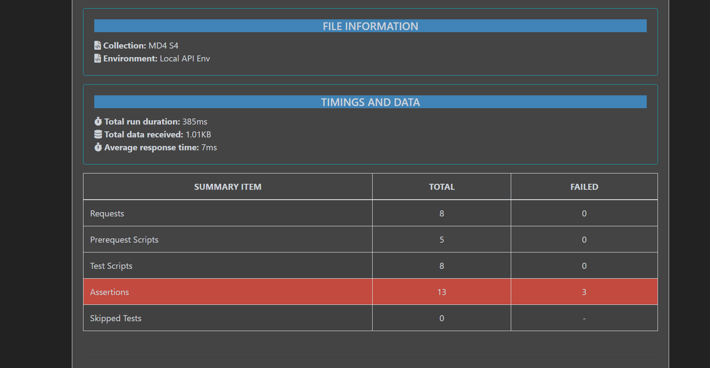
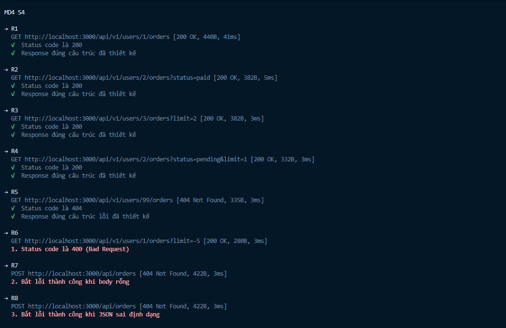

# Báo cáo Test API Nested Resource

## 1. Test URL đầy đủ tham số

- **URL**: `GET http://localhost:3000/api/v1/users/2/orders?status=paid&limit=1`
- **Kết quả trả về**:

```json
{
  "success": true,
  "data": [
    {
      "id": 4,
      "userId": 2,
      "status": "paid",
      "total": 120000
    }
  ],
  "meta": {
    "total": 2
  }
}
```

_(Giải thích: User 2 có tổng cộng 2 đơn 'paid', nhưng do limit=1 nên data chỉ trả về 1 bản ghi)._

## 2. Test URL không truyền tham số (Sử dụng mặc định)

- **URL**: `GET http://localhost:3000/api/v1/users/1/orders`
- **Kết quả trả về**:

```json
{
  "success": true,
  "data": [
    { "id": 1, "userId": 1, "status": "paid", "total": 150000 },
    { "id": 2, "userId": 1, "status": "pending", "total": 200000 },
    { "id": 3, "userId": 1, "status": "cancelled", "total": 50000 }
  ],
  "meta": {
    "total": 3
  }
}
```

_(Giải thích: Lấy tất cả trạng thái, mặc định trả về tối đa 5 đơn. User 1 có 3 đơn nên trả về cả 3)._

## 3. Test URL với userId không tồn tại

- **URL**: `GET http://localhost:3000/api/v1/users/99/orders`
- **HTTP Status Code**: `404 Not Found`
- **Kết quả trả về**:

```json
{
  "success": false,
  "code": "USER_NOT_FOUND",
  "message": "Không tìm thấy người dùng này."
}
```

## 4. Tự động hoá Test với Postman

- Đã tạo biến môi trường `base_url`.
- File Collection và Environment đã được export và lưu tại thư mục `/postman` của repository.

## 5. Tự động hoá Test với Newman

- Đã bổ sung 3 test case biên (Edge cases).
- Báo cáo HTML được generate thành công tại thư mục `/reports`.
- **Kết quả Newman Report:**
  
  
